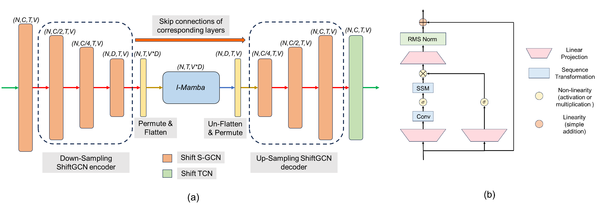

# Simba 
This is the official implementation of our paper [Simba: Mamba augmented U-ShiftGCN for Skeletal Action Recognition in Videos](https://arxiv.org/abs/2404.07645). To the best of our knowledge, this is the first skeleton action recognition model based on Mamba augmentation with GCN. 

## News

- [ ] Make pre-trained models available.
- [ ] This repo borrows inspiration from multiple codebases. Therefore, some files are redundant. Working towards cleaning the repo !
- [x] Make the code available.

## Simba architecture
<p align="center">
   
</p>

# Preparation
### Install torchlight
Run `pip install -e torchlight`
### Install dependencies
```
pip install -r requirements.txt
```

### Download datasets.

#### There are 3 datasets to download:

- NTU RGB+D 60 Skeleton
- NTU RGB+D 120 Skeleton
- NW-UCLA

#### NTU RGB+D 60 and 120

1. Request dataset here: https://rose1.ntu.edu.sg/dataset/actionRecognition
2. Download the skeleton-only datasets:
   1. `nturgbd_skeletons_s001_to_s017.zip` (NTU RGB+D 60)
   2. `nturgbd_skeletons_s018_to_s032.zip` (NTU RGB+D 120)
   3. Extract above files to `./data/nturgbd_raw`

#### NW-UCLA

1. Download dataset from [CTR-GCN](https://github.com/Uason-Chen/CTR-GCN)
2. Move `all_sqe` to `./data/NW-UCLA`

### Data Processing

#### Directory Structure

Put downloaded data into the following directory structure:

```
- data/
  - NW-UCLA/
    - all_sqe
      ... # raw data of NW-UCLA
  - ntu/
  - ntu120/
  - nturgbd_raw/
    - nturgb+d_skeletons/     # from `nturgbd_skeletons_s001_to_s017.zip`
      ...
    - nturgb+d_skeletons120/  # from `nturgbd_skeletons_s018_to_s032.zip`
      ...
```

#### Generating Data

- Generate NTU RGB+D 60 or NTU RGB+D 120 dataset:

```
 cd ./data/ntu # or cd ./data/ntu120
 # Get skeleton of each performer
 python get_raw_skes_data.py
 # Remove the bad skeleton 
 python get_raw_denoised_data.py
 # Transform the skeleton to the center of the first frame
 python seq_transformation.py
```

# Evaluation

```
bash evaluate.sh
```

# Training & Testing

### Training

```
bash train.sh
```

Please check the configuration in the config directory.

### Testing

```
bash evaluate.sh
```

To ensemble the results of different modalities, run the following command:

```
bash ensemble.sh
```

## Acknowledgements

This repo is based on [Hyperformer](https://github.com/ZhouYuxuanYX/Hyperformer), [Mamba](https://github.com/state-spaces/mamba) and [Shift-GCN](https://github.com/kchengiva/Shift-GCN).

Thanks to the original authors for their work!

## Citation

Please cite this work if you find it useful:
````BibTeX
@article{chaudhuri2024simba,
  title={Simba: Mamba augmented U-ShiftGCN for Skeletal Action Recognition in Videos},
  author={Chaudhuri, Soumyabrata and Bhattacharya, Saumik},
  journal={arXiv preprint arXiv:2404.07645},
  year={2024}
}
````

# Contact
For any questions, feel free to raise an issue !

